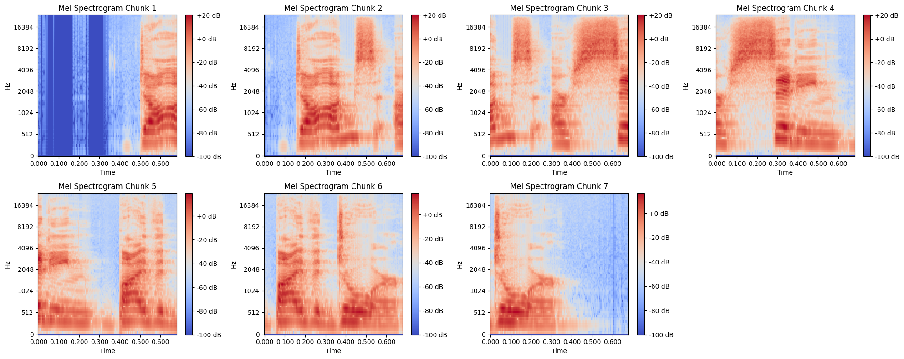
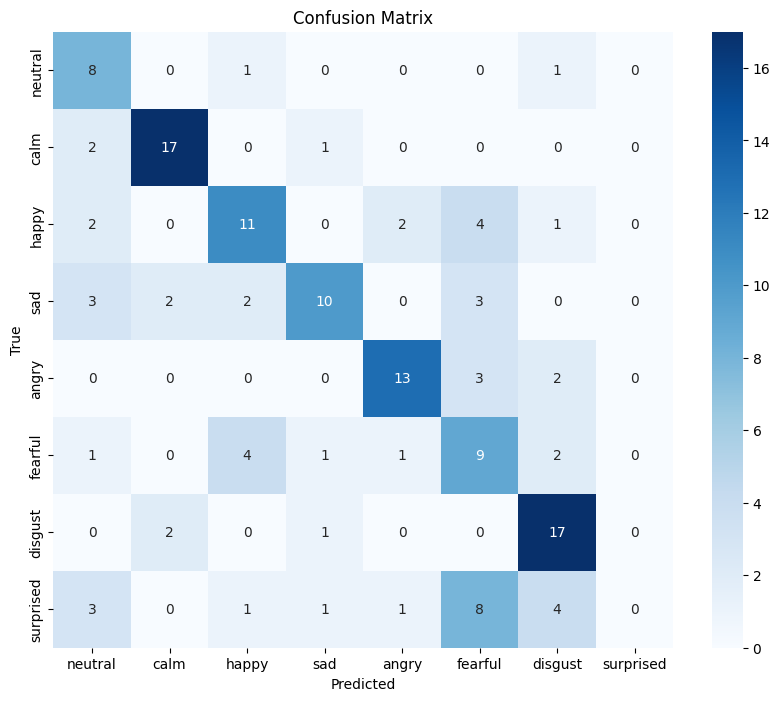

# Speech Emotion Recognition

A deep learning system for recognizing emotions from speech audio using PyTorch. This project implements a hybrid CNN-LSTM architecture with attention mechanism to classify emotional states from audio recordings.

## Objective

The goal of this project is to build an accurate emotion recognition system that can classify human emotions from speech audio into 8 different emotional categories. The system combines convolutional neural networks for feature extraction from mel-spectrograms with recurrent neural networks for temporal modeling, enhanced by an attention mechanism for improved classification performance.

## Dataset

This project uses the **RAVDESS (Ryerson Audio-Visual Database of Emotional Speech and Song)** dataset, which contains:
- 8 emotion categories: neutral, calm, happy, sad, angry, fearful, disgust, surprised
- Audio recordings from 24 professional actors (12 female, 12 male)
- Standardized file naming convention: `03-01-{emotion}-{intensity}-{statement}-{repetition}-{actor}.wav`
- Sample rate: 48 kHz

## Data Preparation and Feature Extraction

### Audio Preprocessing Pipeline

1. **Audio Loading and Resampling**
   - Load audio files using `torchaudio`
   - Resample to standardized 48 kHz sample rate
   - Convert stereo to mono by averaging channels

2. **Audio Formatting**
   - Skip first 0.5 seconds to remove silence
   - Trim or pad audio to exactly 3 seconds (144,000 samples)
   - Zero-padding for shorter recordings

3. **Feature Extraction - Mel-Spectrograms**
   - **Mel-Spectrogram Parameters:**
     - n_mels: 128 frequency bands
     - n_fft: 1024 (FFT window size)
     - hop_length: 256 samples
     - win_length: 512 samples
     - Window function: Hamming window
   - Convert amplitude to decibel scale
   - **Chunking Strategy:**
     - Sliding window approach with 128-frame windows
     - Stride of 64 frames (50% overlap)
     - Results in temporal sequences of mel-spectrogram chunks

### Data Augmentation

To improve model robustness and prevent overfitting, several augmentation techniques are applied:

1. **Additive White Gaussian Noise (AWGN)**
   - Random SNR between 15-30 dB
   - Simulates real-world noise conditions

2. **Speed Perturbation**
   - Slight speed variations to simulate natural speech variations
   - Maintains pitch while changing tempo

3. **Preemphasis Filtering**
   - High-frequency emphasis to balance spectral energy
   - Improves consonant detection

The training dataset is expanded by 4x through these augmentation techniques.

## Model Architecture

### Hybrid CNN-LSTM with Attention

The model consists of four main components:

#### 1. CNN Feature Extractor (TimeDistributed)
```
Input: (batch_size, sequence_length, 1, 128, 128)
├── Conv2D (1→16) + BatchNorm + ReLU + MaxPool2D(2×2) + Dropout(0.3)
├── Conv2D (16→32) + BatchNorm + ReLU + MaxPool2D(4×4) + Dropout(0.3)
└── Conv2D (32→64) + BatchNorm + ReLU + MaxPool2D(4×4) + Dropout(0.3)
Output: (batch_size, sequence_length, 1024)
```

#### 2. Feature Projection
- Linear layer: 1024 → 256 dimensions
- Reduces CNN output dimensionality for LSTM processing

#### 3. Bidirectional LSTM
- Input size: 256
- Hidden size: 128 (256 total with bidirectional)
- Captures temporal dependencies in both directions
- Dropout: 0.4 for regularization

#### 4. Attention Mechanism
- Attention weights computed from LSTM outputs
- Softmax normalization across time steps
- Context vector generation through weighted sum
- Enables focus on most relevant temporal segments

#### 5. Classification Head
- Linear layer: 256 → 8 emotions
- Softmax activation for probability distribution

### Model Evaluation
The trained models are saved in the `models/` directory.



## Usage

### Training a New Model
```python
# Run the training notebook
jupyter notebook train.ipynb
```

### Real-time Emotion Recognition
```python
# Start the Flask web interface
python interface.py
```

The interface provides:
- Real-time audio recording (3-second clips)
- Instant emotion prediction
- Web-based user interface for easy interaction

### Programmatic Inference
```python
from emotional_model import EmotionalModel, get_emotion_prediction
import torch

# Load trained model
model = EmotionalModel(num_emotions=8)
model.load_state_dict(torch.load('models/best_model.pth'))

# Predict emotion from audio file
emotion = get_emotion_prediction(model, 'path/to/audio.wav')
print(f"Predicted emotion: {emotion}")
```

## Dependencies

Install all dependencies:
```bash
pip install -r requirements.txt
```

## Project Structure
```
emotions/
├── README.md
├── requirements.txt
├── train.ipynb              # Training notebook
├── emotional_model.py       # Model definition and inference
├── interface.py            # Flask web interface
├── audio_data/             # RAVDESS dataset
└── models/                 # Saved model checkpoints
```